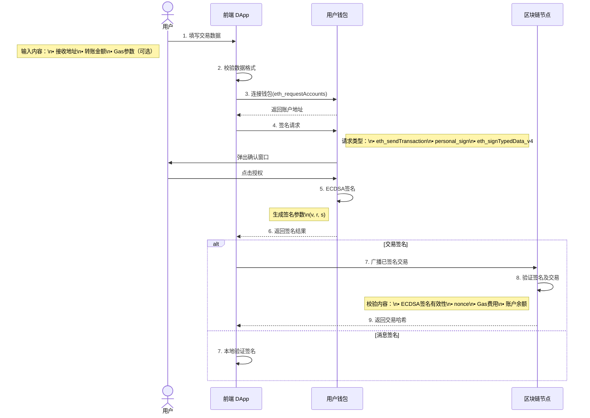

```mermaid
sequenceDiagram
    actor 用户
    participant 前端 as 前端 DApp
    participant 钱包 as 用户钱包
    participant 区块链 as 区块链节点

    用户->>前端: 1. 填写交易数据
    Note left of 用户: 输入内容：\n▪ 接收地址\n▪ 转账金额\n▪ Gas参数（可选）
    前端->>前端: 2. 校验数据格式

    前端->>钱包: 3. 连接钱包(eth_requestAccounts)
    钱包-->>前端: 返回账户地址
    
    前端->>钱包: 4. 签名请求
    Note right of 钱包: 请求类型：\n▪ eth_sendTransaction\n▪ personal_sign\n▪ eth_signTypedData_v4
    钱包->>用户: 弹出确认窗口
    用户->>钱包: 点击授权
    
    钱包->>钱包: 5. ECDSA签名
    Note left of 钱包: 生成签名参数\n(v, r, s)
    
    钱包-->>前端: 6. 返回签名结果
    alt 交易签名
        前端->>区块链: 7. 广播已签名交易
        区块链->>区块链: 8. 验证签名及交易
        Note left of 区块链: 校验内容：\n▪ ECDSA签名有效性\n▪ nonce\n▪ Gas费用\n▪ 账户余额
        区块链-->>前端: 9. 返回交易哈希
    else 消息签名
        前端->>前端: 7. 本地验证签名
    end

```